## TypeScript2.x课程

## 1.TypeScript简介

### 1.JavaScript

JavaScript一种直译式**脚本语言**，是一种**动态类型、弱类型**、基于原型的语言，内置支持类型。它的解释器被称为JavaScript引擎，为浏览器的一部分，广泛用于客户端的脚本语言，最早是在[HTML](https://baike.baidu.com/item/HTML)（标准通用标记语言下的一个应用）**网页上使用，用来给HTML网页增加动态功能**。

**特点：**

1).解析型语言( 可以直接执行 )

2).弱类型语言( 没有类型检查 )

3) CMD 开发方式。CMD 即Common Module Definition**通用模块定义**，CMD规范是国内发展出来的

CommonJS、AMD与CMD规范的区别：http://blog.csdn.net/jackwen110200/article/details/52105493

### 2.TypeScript


TypeScript是一种由**微软开发**的自由和[开源](https://baike.baidu.com/item/%E5%BC%80%E6%BA%90)的编程语言。它是[JavaScript](https://baike.baidu.com/item/JavaScript)的一个**超集**，而且本质上向JavaScript语言添加了**可选的静态类型**和基于类的[面向对象编程](https://baike.baidu.com/item/%E9%9D%A2%E5%90%91%E5%AF%B9%E8%B1%A1%E7%BC%96%E7%A8%8B)。[安德斯·海尔斯伯格](https://baike.baidu.com/item/%E5%AE%89%E5%BE%B7%E6%96%AF%C2%B7%E6%B5%B7%E5%B0%94%E6%96%AF%E4%BC%AF%E6%A0%BC)，[C#](https://baike.baidu.com/item/C%23)的首席架构师，已工作于TypeScript的开发。2012年十月份，微软发布了首个公开版本的TypeScript，2013年6月19日，在经历了一个预览版之后微软正式发布了正式版TypeScript 0.9，向未来的TypeScript 1.0版迈进了很大一步。

**特点：**

1).编译型语言( 将 ts 编译成 js  ; ts不可以直接执行 )

2).强类型语言(  类似 :  Java  ,  C#  , 有类型检查 )

3).真正面向对象的语言（继承，接口，封装 ，泛型 ...）

4).AMD开发方式。AMD 即Asynchronous Module Definition，中文名是**异步模块定义**的意思。它是一个在浏览器端模块化开发的规范。

CommonJS、AMD与CMD规范的区别：http://blog.csdn.net/jackwen110200/article/details/52105493


**TypeScript中文文档：**https://www.tslang.cn/docs/handbook/typescript-in-5-minutes.html

TypeScript 教程： https://www.w3cschool.cn/typescript/

### 3.为什么学习TypeScript

用过的人基本都说它好用：https://www.tslang.cn/index.html#download-links

也是未来的趋势

## 2.TypeScript环境搭建

### 1.安装TypeScript编译器

#### 1.安装node环境

[https://nodejs.org/en/](https://nodejs.org/en/) 到官网下载默认安装，安装好后就可以npm包管理器

```
node -v  // 检查是否安装好node
```

#### 2.安装TypeScript编译器

通过npm包管理器安装TypeScript命令行工具

```
npm install -g typescript   // typescript 是一个编译器，负者将ts文件编译成js文件
```

最后可以在命令行执行`tsc` 检查typescript是否安装成功

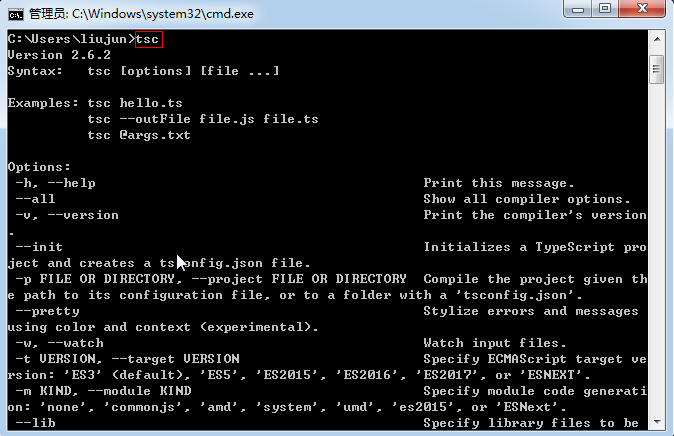

### 2.编译ts文件

1.编写typescript文件

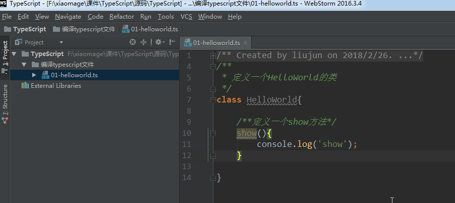

```js
/**
 * 定义一个HelloWorld的类
 */
class HelloWorld{

    /**定义一个show方法*/
    show(){
        console.log('show');
    }

}
```


2.将typescript文件编译成js文件

```
tsc 01-helloworld.ts   //将typescript文件编译成js文件
```

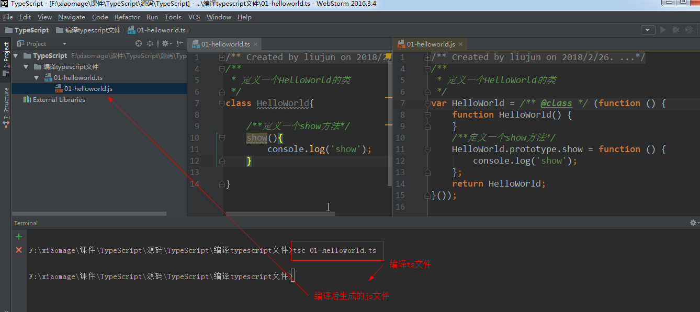

> 注意：webStrom默认会自动将ts文件编译成js文件


## 3.TypeScript基本数据类型

基本类型：https://www.tslang.cn/docs/handbook/basic-types.html

```
boolean number string   Array  enum any void  null undefined symbol
```

### 1.boolean

1.ts定义boolean类型变量

```js
/**js写法*/
var isDone1=true;

/**ts写法*/
var isDone2:boolean=false;
console.log(isDone1,isDone2);
```

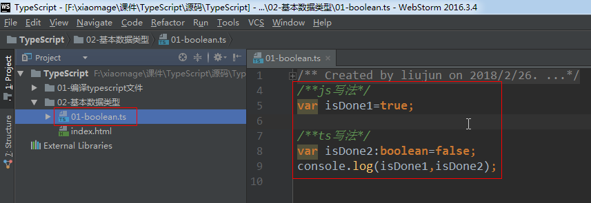

2.ts文件编译成js文件


3.执行js文件

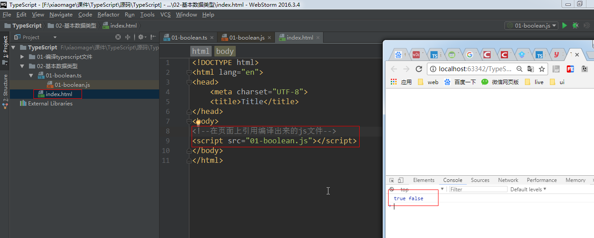

### 2.number

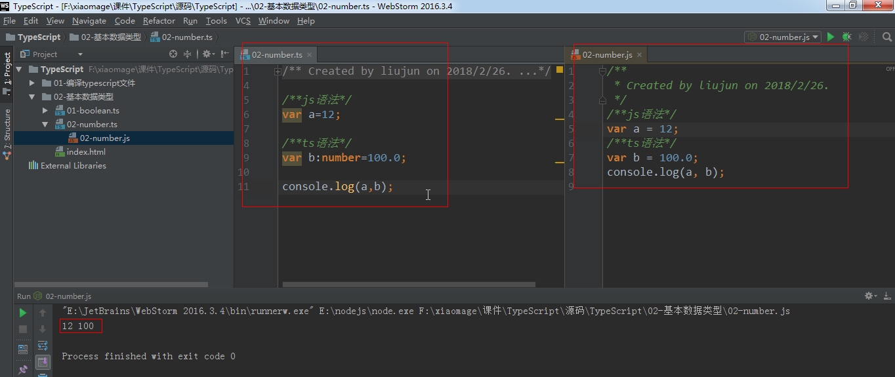

### 3.string

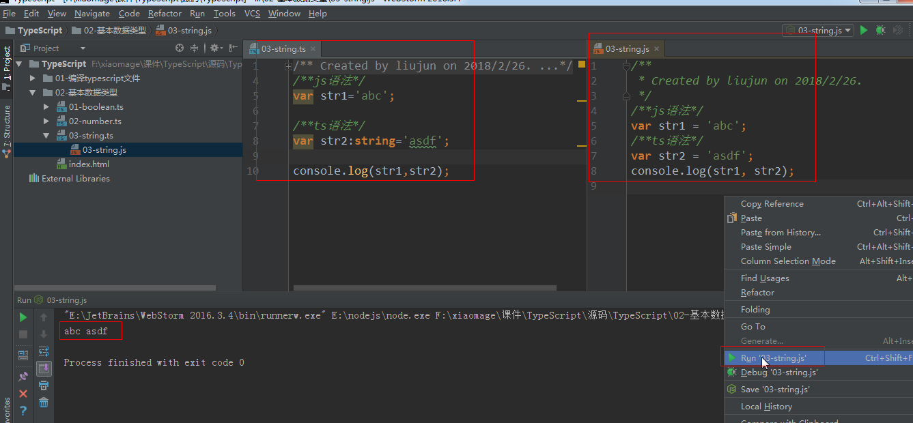

### 4.Array

https://www.tslang.cn/docs/handbook/basic-types.html

#### 1.第一种方式声明数组

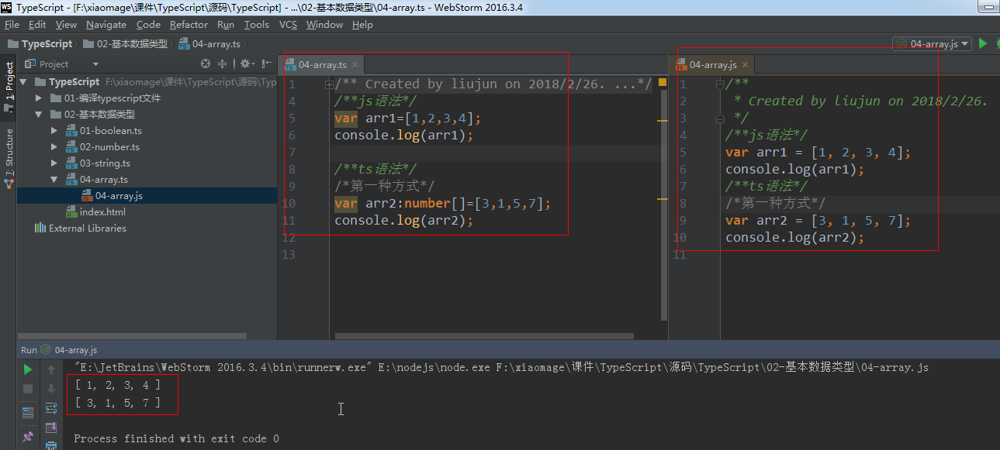

#### 2.第二种方式声明数组

使用数组泛型，`Array<元素类型>`


### 5.enum

#### 1.定义枚举

```js
/**js语法*/
...
/**ts语法*/
enum College2{
    IOS,
    Android,
    HTML5,
    UI
}
console.log(College2.HTML5); // 获取枚举的索引  2
console.log(College2[2]);  //获取枚举的名称 HTML5
```

默认情况下，IOS , Android,HTML5,UI从`0`开始为元素编号。 你也可以手动的指定成员的数值。 如下图

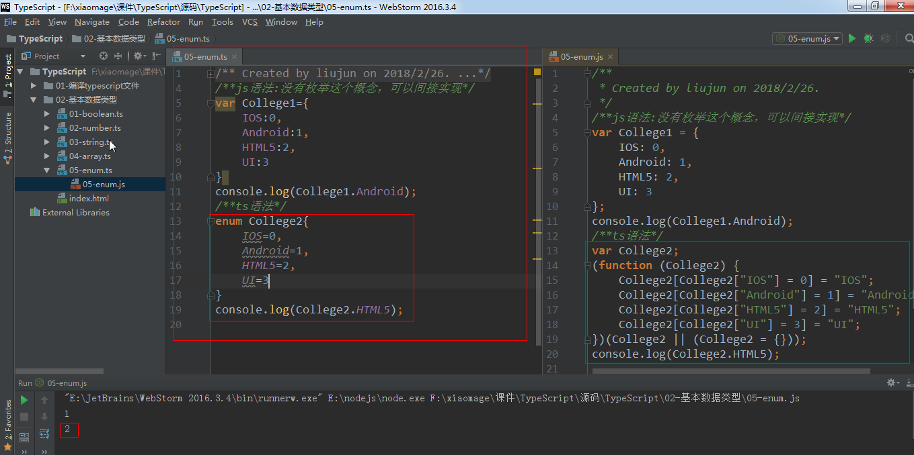

#### 2.枚举的使用

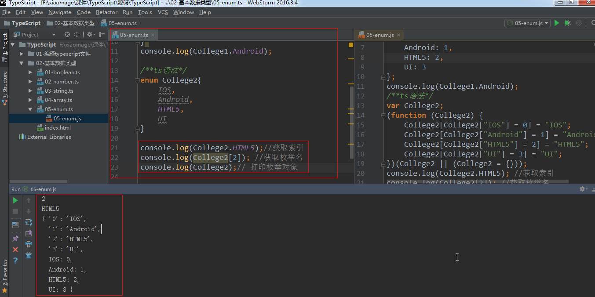

```
/**ts语法*/
enum College2{
    IOS,
    Android,
    HTML5,
    UI
}
// 返回的类型是College2枚举类型(number也可以)
var index:College2=College2.HTML5;//获取索引
// 返回的类型是string类型
var College2Name:string=College2[2];//获取枚举名

console.log(index);//获取索引
console.log(College2Name); //获取枚举名
console.log(College2);// 打印枚举对象
```

### 6.any

是任意类型

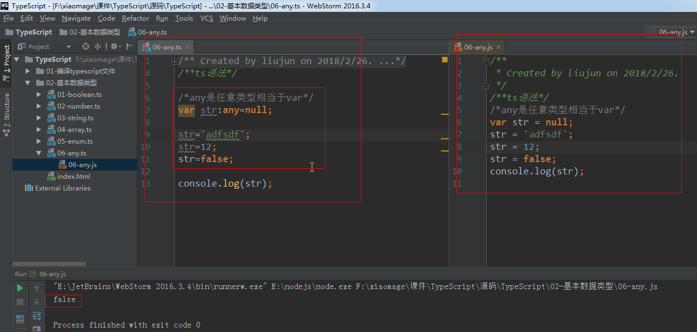


### 7.void

#### 1.void声明变量

void声明的变量时，变量 只能为赋予`undefined和null`，赋予其它会报错。

](15.png)

#### 2.void声明函数返回类型(常用)

```js
/**ts语法:声明函数的返回类型位string*/
function show2():string{
    return 'show2'
}

/**ts语法:声明函数的返回类型位void*/
function show3():void{
}
```

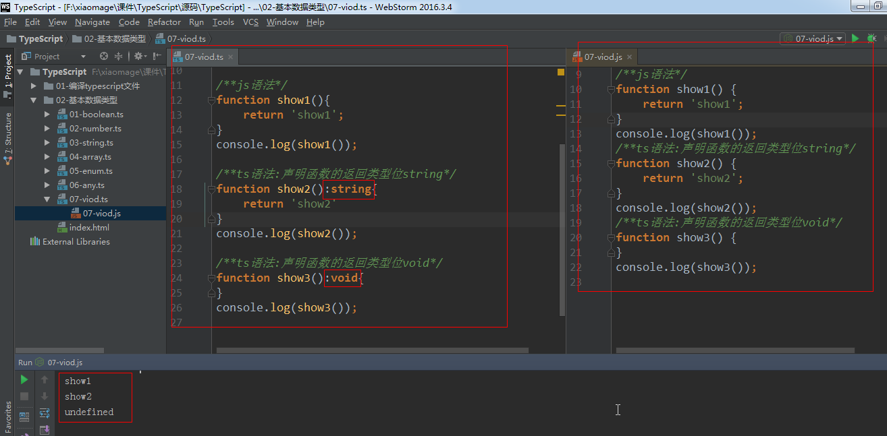

### 8.类型推测

在编译时, 发现代码中的类型使用有错时会报错

#### 1.var变量会自定推测其类型

https://www.tslang.cn/docs/handbook/type-inference.html

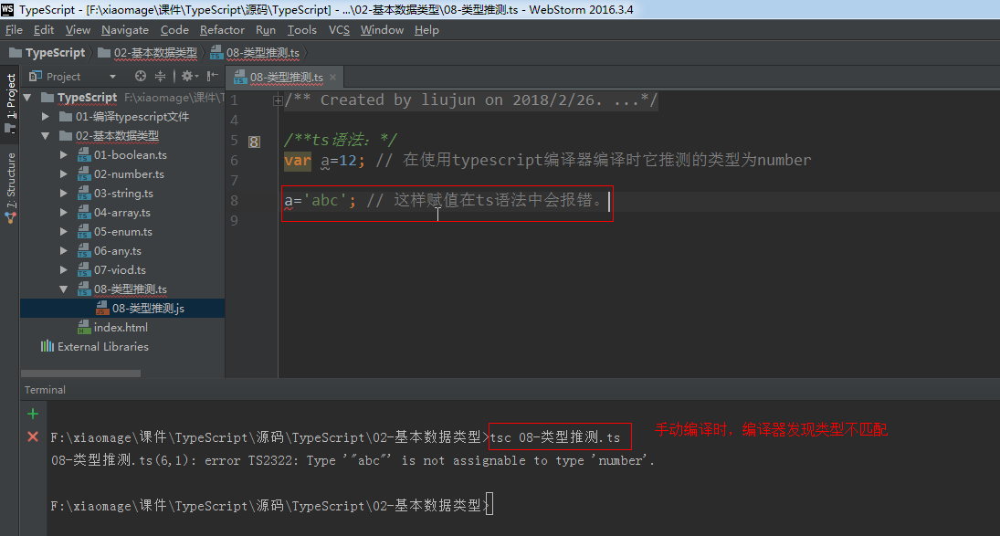

在编译时, 发现代码中的类型使用有错时会报错：

****error TS2322: Type 'abc' is not assignable to type 'number'.****

#### 2.数组也会自动推测其类型

```
var arr=[3,'asd',false,3]; // 编译器自动推测其类型为any 
arr[4]='sdf'; // 不会报错
```

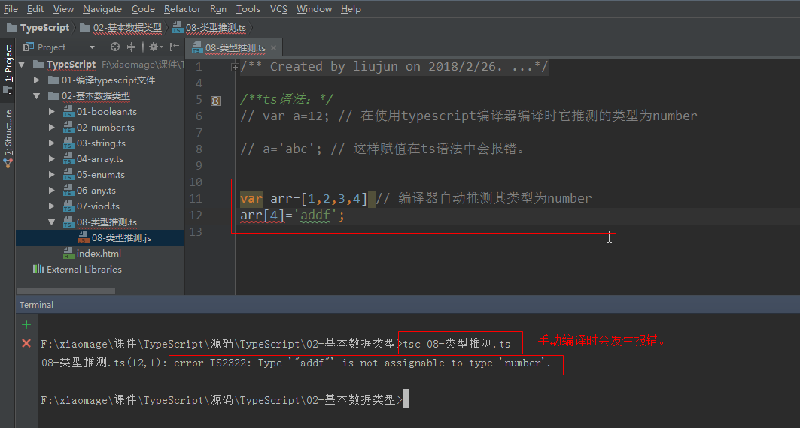

在编译时 , 发现代码中的类型使用有错时会报错：

****error TS2322: Type 'addf' is not assignable to type 'number'.****

### 9.冲突检查

在编译时， 发现代码有冲突的地方会报错：

**error TS2678: Type 'string' is not comparable to type 'number'.**

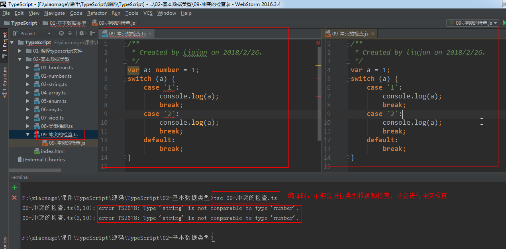

### 10.联合类型

#### 1.在变量中使用

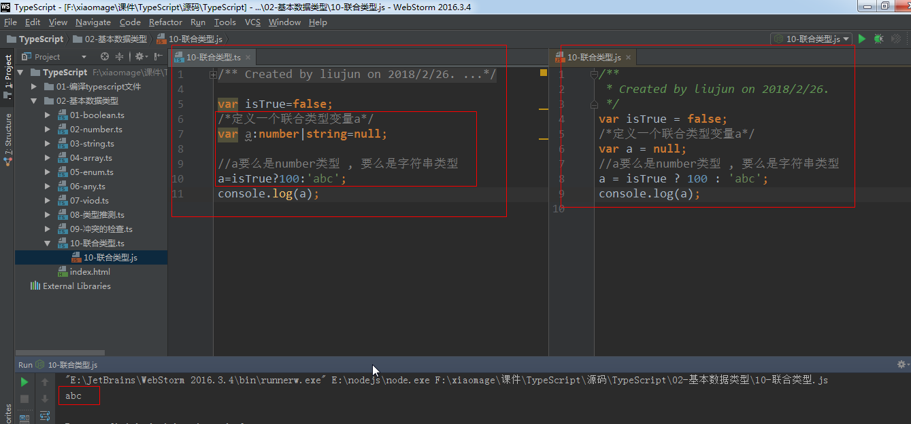

#### 2.在参数中使用

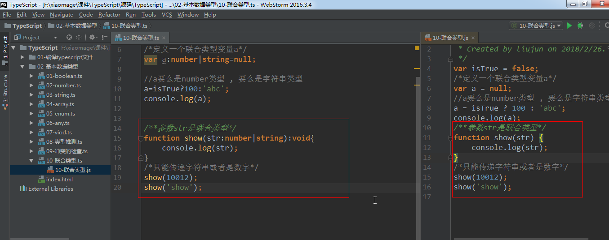


## 4.TypeScript类-Class

https://www.tslang.cn/docs/handbook/classes.html

### 1.类的创建

**1.js创建一个Person类**

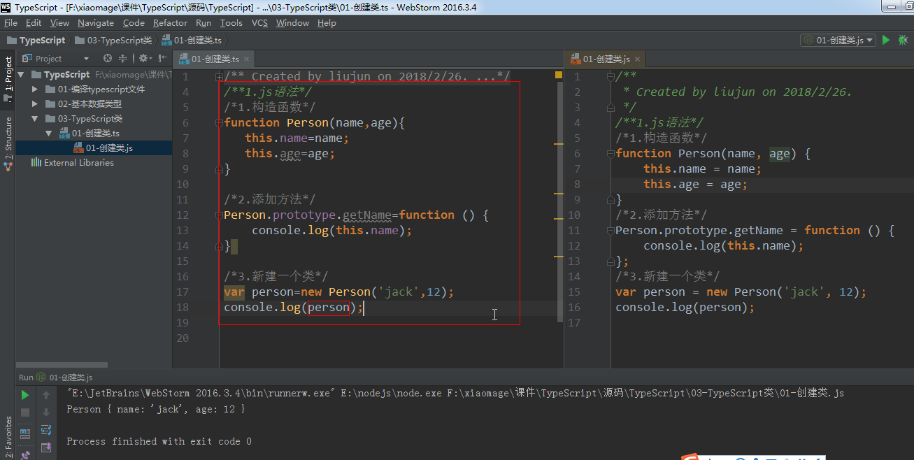

```js
/*1.构造函数*/
function Person(name,age){
   this.name=name;
   this.age=age;
}

/*2.添加方法*/
Person.prototype.getName=function () {
    console.log(this.name);
}

/*3.新建一个person对象*/
var person=new Person('jack',12);
console.log(person);
```

**2.ts创建一个Person类**

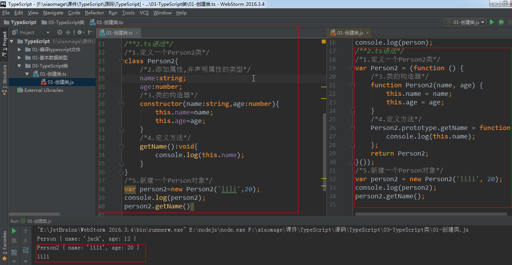

```js
/*1.定义一个Person2类*/
class Person2{
    /*2.添加属性,并声明属性的类型*/
    name:string;
    age:number;
    /*3.类的构造器*/
    constructor(name:string,age:number){
        this.name=name;
        this.age=age;
    }
    /*4.定义方法*/
    getName():void{
        console.log(this.name);
    }
}
/*5.新建一个Person对象*/
var person2=new Person2('lili',20);
console.log(person2);
person2.getName()
```


### 2.类的继承

1.js实现类的继承

**原型式继承 , 原型链继承 ,借用构造函数 , 组合继承 ...**

```js
/**1.js语法*/
/*1.定义一个Person1类*/
function Person1(name,age){
    this.name=name;
    this.age=age;
}

Person1.prototype.getName=function () {
    console.log(this.name);
}

/*2.定义一个Student类*/
function Student(name,age,job){
    /*借用构造器函数*/
    Person1.call(this,name,age);
    this.job=job;
}

/*3.让Student类继承Person1类 (原型链继承)*/
Student.prototype=new Person1();
Student.prototype.constructor=Student;

/*4.给Student类添加方法*/
Student.prototype.getJob=function () {
    console.log(this.job);
}

/*5.新建一个Student对象*/
var student=new Student('jack',23,'study');
console.log(student);
student.getJob();
student.getName();
```

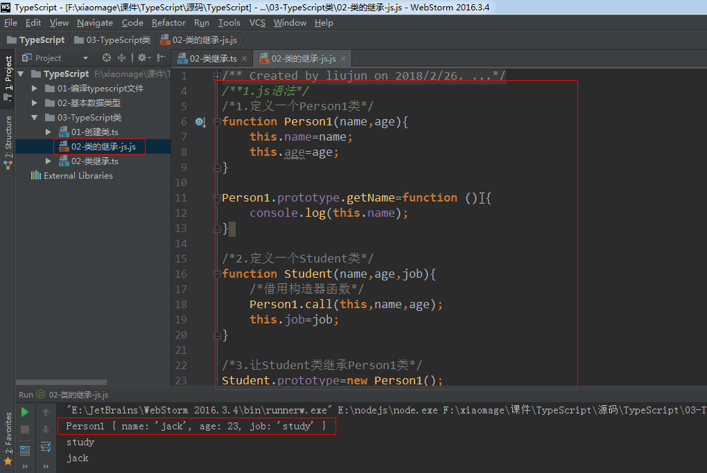


2.ts实现类的继承

```js
/**
 * Created by liujun on 2018/2/26.
 */
/**2.ts语法*/
/*1.定义一个Person2类*/
class Person2{
    /*2.添加属性,并声明属性的类型*/
    name:string;
    age:number;
    /*3.类的构造器*/
    constructor(name:string,age:number){
        this.name=name;
        this.age=age;
    }
    /*4.定义方法*/
    getName():void{
        console.log(this.name);
    }
}


/*2.定义Student类,并且继承Person2类*/
class Student extends Person2{
    /*2.添加属性,并声明属性的类型*/
    job:string;

    /*3.类的构造器*/
    constructor(name:string,age:number,job:string){
        /*必须放在最前面,调用父亲的构造函数*/
        super(name,age);
        this.job=job;
    }

    /*4.定义方法*/
    getJob():void{
        console.log(this.job);
    }
}

/*5.新建一个Student对象*/
var student=new Student('lili',5,'play');
console.log(student);
student.getJob();
```

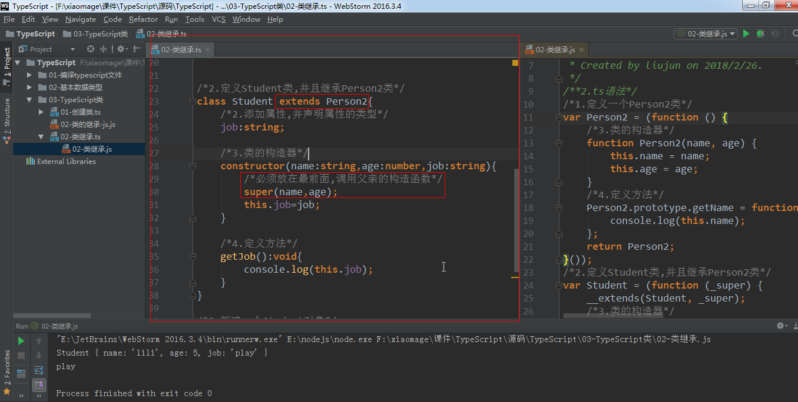

### 3.访问修饰符-变量和方法

**访问修饰符：**

* **public  公有，谁都可以访问**
* **protected 保护，子类和自身可以访问**
* **private 私有，只能自己访问**

1.给变量和方法添加访问修饰符（变量和方法默认都是public）。

```js
/**
 * Created by liujun on 2018/2/26.
 */
/**
 * 修饰符：
 * public  公有，谁都可以访问
 * protected 保护，子类可以访问
 * private 私有，只能自己访问
 * */
/*1.定义一个Person2类*/
class Person2{
    /*2.添加属性,并声明属性的类型*/
    public name:string;
    public age:number;
    /*3.类的构造器*/
    constructor(name:string,age:number){
        this.name=name;
        this.age=age;
    }
    /*4.定义方法*/
    public getName():void{
        console.log(this.name);
    }
}


/*2.定义Student类,并且继承Person2类*/
class Student extends Person2{
    /*2.添加属性,并声明属性的类型*/
    public job:string;

    /*3.类的构造器*/
    constructor(name:string,age:number,job:string){
        /*必须放在最前面,调用父亲的构造函数*/
        super(name,age);
        this.job=job;
    }

    /*4.定义方法*/
    public getJob():void{
        console.log(this.job);
    }
}

/*5.新建一个Student对象*/
var student=new Student('lili',5,'play');
student.name='lose';
console.log(student);
```

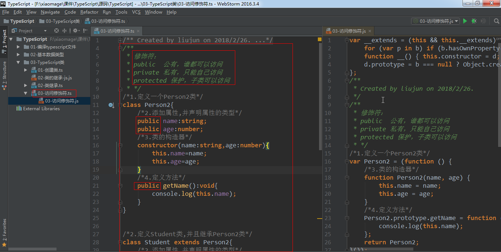

> 注意：
>
> 1.如果修改name属性的访问权限为protected , 那么name这个属性只能在Person2类里面和Student类里面访问。
>
> 2.如果修改name属性的访问权限为private, 那么name这个属性只能在Person2类里面访问。
>
> 3.如果修改name属性的访问权限为public, 那么name这个属性在Person2类里面，Student类里面或者外部都可以访问
>
> 4.如果是方法也是一样的原理


2.参数属性

*参数属性*可以方便地让我们在一个地方**定义并初始化一个类的成员**

https://www.tslang.cn/docs/handbook/classes.html

```js
/*1.定义一个Person2类*/
class Person2{
    /*3.类的构造器( 构造器里的参数会自动完成属性的定义和初始化 )*/
    constructor(public name:string,public age:number){
    }
    /*4.定义方法*/
    public getName():void{
        console.log(this.name);
    }
}


/*2.定义Student类,并且继承Person2类*/
class Student extends Person2{
   ...
   ...
}

/*5.新建一个Student对象*/
var student=new Student('lili',5,'play');
console.log(student);
student.getName();
```


### 4.*类的封装

1.下面使用ts来封装一个Person类。

```js
/**封装一个Person类*/
class Person{
    /**private把_name属性隐藏起来，提供get set方法类访问_name属性*/
    private  _name:string;
    private _age:number;/**一般私有的属性，最好有个_下划线*/

    public get name(){
        return this._name;
    }

    public set name(name:string){
        this._name=name;
    }

    public get age(){
        return this._age;
    }
    /**这里可以进行容错处理*/
    public set age(age:number){
        if(age>200 || age<0){
            throw '年龄输入有误';
        }else{
            this._age=age;
        }

    }
}

var person=new Person();
// person.name='jack'; //这里相当于调用了set name的方法
person.age=230; //如果年龄是不正确的，会报错
// console.log(person.name);
// console.log(person.age);
```

2.使用js来封装Person类

```js
/**封装一个Person类*/
var Person = (function () {
    function Person() {
    }
    Object.defineProperty(Person.prototype, "name", {
        get: function () {
            return this._name;
        },
        set: function (name) {
            this._name = name;
        },
        enumerable: true,
        configurable: true
    });
    Object.defineProperty(Person.prototype, "age", {
        get: function () {
            return this._age;
        },
        /**这里可以进行容错处理*/
        set: function (age) {
            if (age > 200 || age < 0) {
                throw '年龄输入有误';
            }
            else {
                this._age = age;
            }
        },
        enumerable: true,
        configurable: true
    });
    return Person;
}());
var person = new Person();
// person.name='jack';
person.age = 230; //如果年龄是不正确的，会报错
// console.log(person.name);
// console.log(person.age);
```


### 5.*类静态属性-static

1.ts定义静态的属性

```js
/**封装一个Person类*/
class Person{
    /**定义了一个私有的属性。属于实例级别的属性*/
    private  _name:string;
    /**定义了个一个共有的静态的属性。属于类级别的属性*/
    public static eyeNumber:number=2;
    
    public get name(){
        return this._name;
    }

    public set name(name:string){
        this._name=name;
    }


}
var person:Person=new Person();
person.name='lose'; //访问了set方法
console.log(person.name);//访问了get方法
console.log(Person.eyeNumber); // 直接通过类名来访问
```

2.js定义静态的属性

```js
/**封装一个Person类*/
var Person = (function () {
    function Person() {
    }
    Object.defineProperty(Person.prototype, "name", {
        get: function () {
            return this._name;
        },
        set: function (name) {
            this._name = name;
        },
        enumerable: true,
        configurable: true
    });
    /**定义了个一个共有的静态的属性。属于类级别的属性*/
    Person.eyeNumber = 2;
    return Person;
}());
var person = new Person();
person.name = 'lose'; //访问了set方法
console.log(person.name); //访问了get方法
console.log(Person.eyeNumber); // 直接通过类名来访问
```


## 5.TypeScript函数

https://www.tslang.cn/docs/handbook/functions.html

### 1.函数类型

在ts中函数是有类型的

#### 1.给函数的参数指定类型

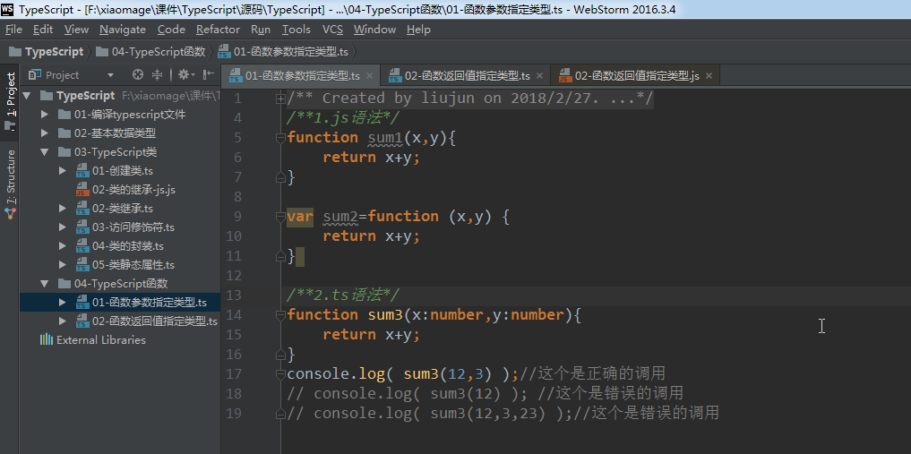

> 注意：调用的时候参数的个数要一一对上

```js
/**1.js语法*/
function sum1(x,y){
    return x+y;
}

var sum2=function (x,y) {
    return x+y;
}

/**2.ts语法*/
function sum3(x:number,y:number){
    return x+y;
}

console.log( sum3(12,3) );//这个是正确的调用
// console.log( sum3(12) ); //这个是错误的调用
// console.log( sum3(12,3,23) );//这个是错误的调用
```

#### 2.给函数的返回值指定类型

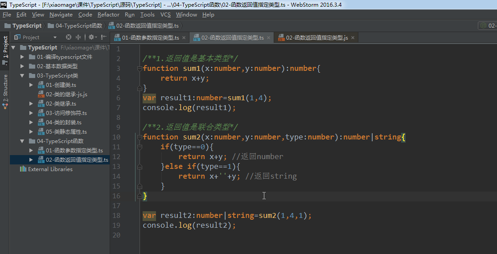

1.返回值是基本类型

```js
/**1.返回值是基本类型：只能返回指定的类型*/
function sum1(x:number,y:number):number{
    return x+y;
}
var result1:number=sum1(1,4);
console.log(result1);
```

2.返回值是联合类型

```js
/**2.返回值是联合类型:只能返回指定的类型*/
function sum2(x:number,y:number,type:number):number|string{
    if(type==0){
        return x+y; //返回number
    }else if(type==1){
        return x+''+y; //返回string
    }
}

var result2:number|string=sum2(1,4,1);
console.log(result2);
```


#### 3.给函数签名

>  什么是给函数签名 ?  1. 要指定函数的参数的个数与对应的类型; 2.要指定函数的返回值类型
>
>  函数签名有什么好处? 在开发时可以准确知道函数的参数代表的意义  和 函数的返回值类型

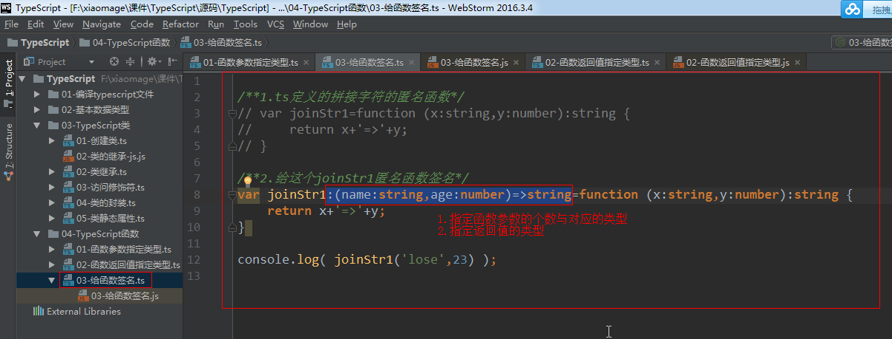

下面给**匿名函数**和**回调函数**签名

```js

/**1.ts定义的拼接字符的匿名函数*/
 var joinStr1=function (x:string,y:number):string {
     return x+'=>'+y;
 }
console.log( joinStr1('lose',23) );

/**2.给这个joinStr1匿名函数签名*/
var joinStr1:(name:string,age:number)=>string=function (x:string,y:number):string {
    return x+'=>'+y;
}
console.log( joinStr1('lose',23) );

/**3.给参数中的callback函数设计签名*/
function ajar(url:string,params:{username:string,psd:string},callback:(result:string,error:number)=>void){
	//callback:(result:string,error:number)=>void  这个是对callback函数的签名
    //params:{username:string,psd:string}  这个是接口的应用，定义一个约定
}

//调用ajar函数
ajar('https://www.baidu.com',{username:'lisi',psd:'123'},function (result:string,error:number) {

})
```

### 2.函数的参数

https://www.tslang.cn/docs/handbook/functions.html

>  之前发现函数的参数个数要一一对上 , 能不能解除这个限制？

#### 1.可选参数-？

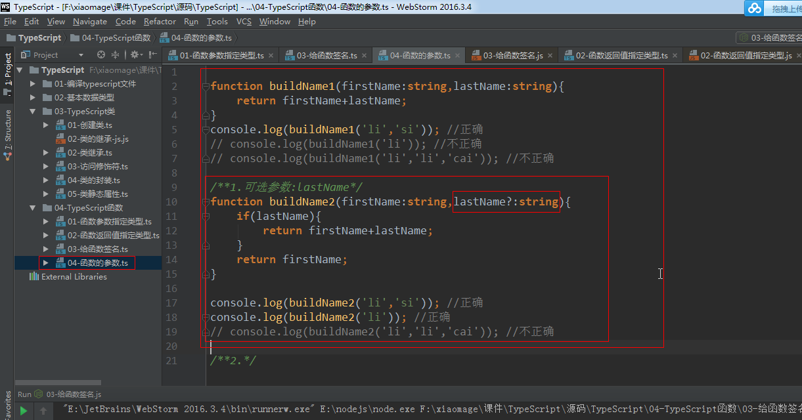

```js
/**1.固定参数*/
function buildName1(firstName:string,lastName:string){
    return firstName+lastName;
}
console.log(buildName1('li','si')); //正确
// console.log(buildName1('li')); //不正确
// console.log(buildName1('li','li','cai')); //不正确

/**1.可选参数:lastName*/
function buildName2(firstName:string,lastName?:string){
    if(lastName){
        return firstName+lastName;
    }
    return firstName;
}

console.log(buildName2('li','si')); //正确
console.log(buildName2('li')); //正确
// console.log(buildName2('li','li','cai')); //不正确
```


#### 2.默认参数-=

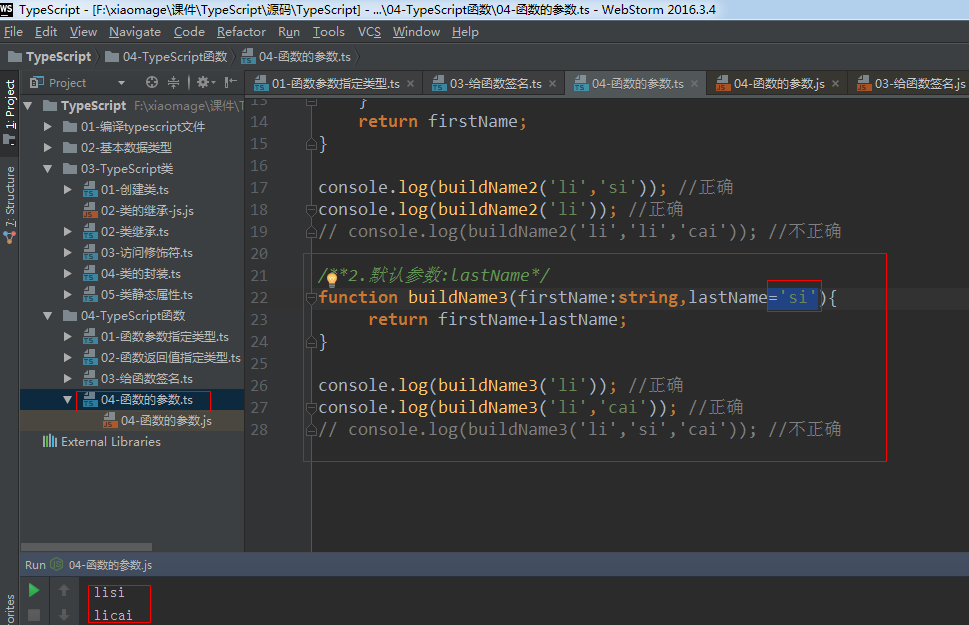

```js
/**2.默认参数:lastName*/
function buildName3(firstName:string,lastName='si'){
     return firstName+lastName;
}

console.log(buildName3('li')); //正确
console.log(buildName3('li','cai')); //正确
// console.log(buildName3('li','si','cai')); //不正确
```

#### 3.（剩余）可变参数- ... []

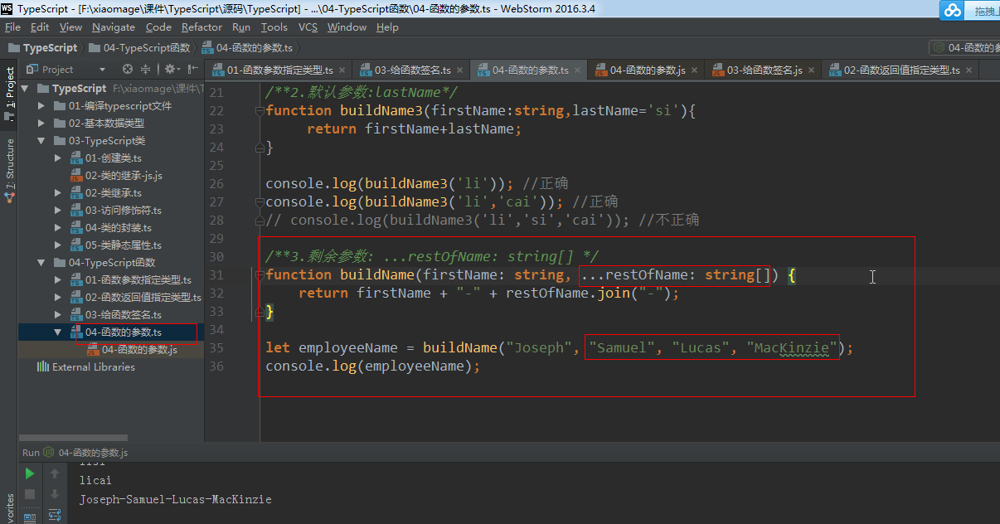

```js
/**3.剩余参数: ...restOfName: string[] */
function buildName(firstName: string, ...restOfName: string[]) {
    return firstName + "-" + restOfName.join("-");
}

let employeeName = buildName("Joseph", "Samuel", "Lucas", "MacKinzie");
console.log(employeeName);
```


## 6.TypeScript接口

https://www.tslang.cn/docs/handbook/interfaces.html

什么是接口 ?  定义**一个规定**或者**一个约定**。注意：typescript中的接口与java中的接口有点不一样

例如：定义一个约定，只要是长和宽相等的四边形就是正方形（正方形Square就是一个接口）。

### 1.接口简单的应用

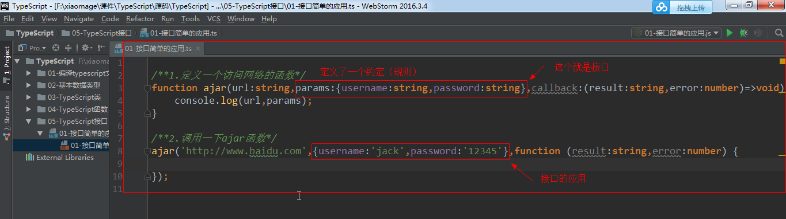

```js

/**1.定义一个访问网络的函数*/
function ajar(url:string,params:{username:string,password:string},callback:(result:string,error:number)=>void) {
    console.log(url,params);
}

/**2.调用一下ajar函数*/
ajar('http://www.baidu.com',{username:'jack',password:'12345'},function (result:string,error:number) {
    
});
```

### 2.创建描述属性类型的接口

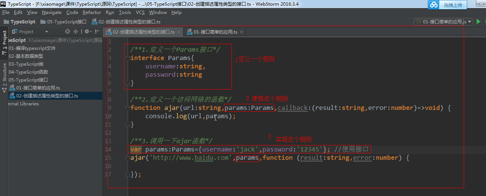

```js
/**1.定义一个Params接口*/
interface Params{
    username:string,
    password:string,
    id?:number, //这个是可选属性
}

/**2.定义一个访问网络的函数*/
function ajar(url:string,params:Params,callback:(result:string,error:number)=>void) {
    console.log(url,params);
}

/**3.调用一下ajar函数*/
var params:Params={username:'jack',password:'12345'}; //实现接口中的属性
ajar('http://www.baidu.com',params,function (result:string,error:number) {

});
```

### 3.创建描述函数类型的接口

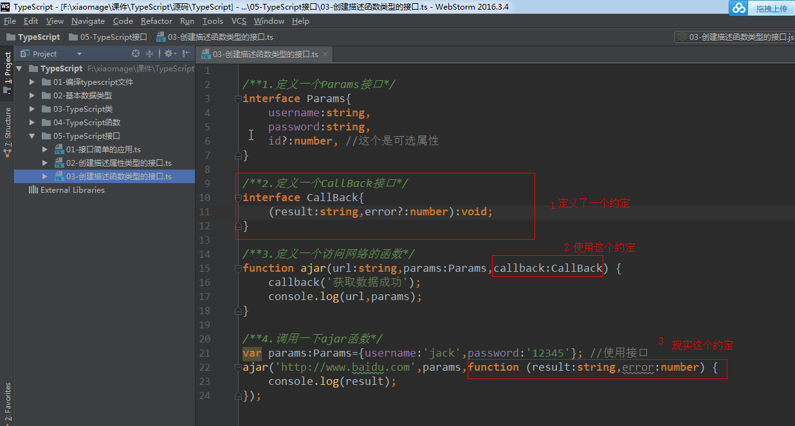

```js

/**1.定义一个 Params 接口*/
interface Params{
    username:string,
    password:string,
    id?:number, //这个是可选属性
}

/**2.定义一个 CallBack 接口*/
interface CallBack{
    (result:string,error?:number):void; // 匿名函数
}

/**3.定义一个访问网络的函数*/
function ajar(url:string,params:Params,callback:CallBack) {
    callback('获取数据成功');
    console.log(url,params);
}

/**4.调用一下ajar函数*/
var params:Params={username:'jack',password:'12345'}; //使用接口
ajar('http://www.baidu.com',params,function (result:string,error:number) {
    console.log(result);
});
```


### 4.创建描述数组类型的接口

```js
/**1.定义一个 Params 接口*/
interface Params{
    [index:number]:string,
}

/**2.定义一个访问网络的函数*/
function ajar(url:string,params:Params,callback:(result:string,error:number)=>void) {
    console.log(url,params);
}

/**3.调用一下ajar函数*/
var params:Params=['lose','12345']; // 实现接口
ajar('http://www.baidu.com',params,function (result:string,error:number) {

});
```

### 5.创建`类`类型的接口

与C#或Java里接口的基本作用一样，TypeScript也能够用它来明确的**强制一个类去符合某种约定**。

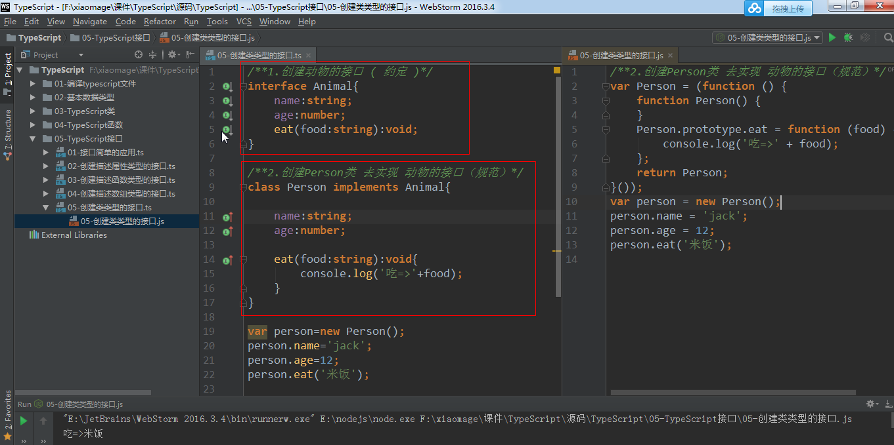

```js
/**1.创建动物的接口 ( 约定 )*/
interface Animal{
    name:string; // 约定的属性
    age:number; // 约定的属性
    eat(food:string):void; // 约定的非匿名函数
}

/**2.创建Person类 去实现 动物的接口（规范）*/
class Person implements Animal{
  
    name:string;//实现接口中的属性, 没有实现这个规范会报错
    age:number;
  
	//实现接口中的函数, 没有实现这个规范会报错
    eat(food:string):void{
        console.log('吃=>'+food);
    }
}

var person=new Person();
person.name='jack';
person.age=12;
person.eat('米饭');
```


## 7.TypeScript泛型

https://www.tslang.cn/docs/handbook/generics.html

### 1.认识泛型

软件工程中，我们不仅要创建一致的定义良好的API，同时也要考虑**可重用性( 通用性 )**。 组件不仅能够支持当前的数据类型，同时也能支持未来的数据类型，这在创建大型系统时为你**提供了十分灵活**的功能。

在像C#和Java这样的语言中，可以使用`泛型`来创建**可重用的组件**，一个**组件可以支持多种类型的数据**。 这样用户就可以以自己的数据类型来使用组件。

> 泛型是定义一个`不确定的类型` 与 `any`是不一样。泛型一般使用T来定义

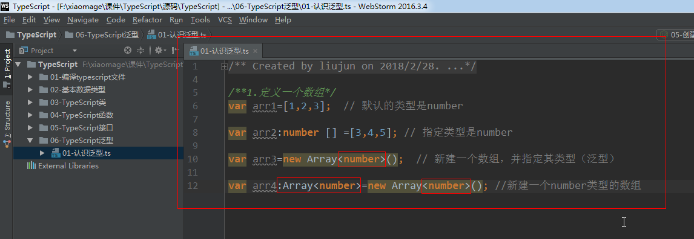

```js
/**1.定义一个数组*/
var arr1=[1,2,3];  // 默认的类型是number

var arr2:number [] =[3,4,5]; // 指定类型是number

var arr3=new Array<number>();  // 新建一个数组，并指定其类型（泛型）

var arr4:Array<number>=new Array<number>(); //新建一个number类型的数组
```


### 2.定义泛型函数

#### 1.泛型函数


```js
/**
 * Created by liujun on 2018/2/28.
 */
/**1.定义指定类型的函数*/
function show1(str:string){
    return str;
}
console.log( show2('lili') );

/**2.定义any类型的函数*/
function show2(str:any){
    return str;
}
console.log( show2(false) );

/**3.定义泛型函数：灵活性高*/
function show3<T>(t:T):T{
    return t;
}
console.log( show3<string>('lose') );
```

#### 2.泛型类型

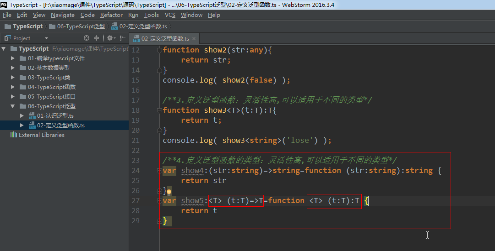

```js
/**4.定义泛型函数的类型：灵活性高,可以适用于不同的类型*/
var show4:(str:string)=>string=function (str:string):string {
    return str
}
var show5:<T> (t:T)=>T=function <T> (t:T):T {
    return t
}
```

### 3.定义泛型类

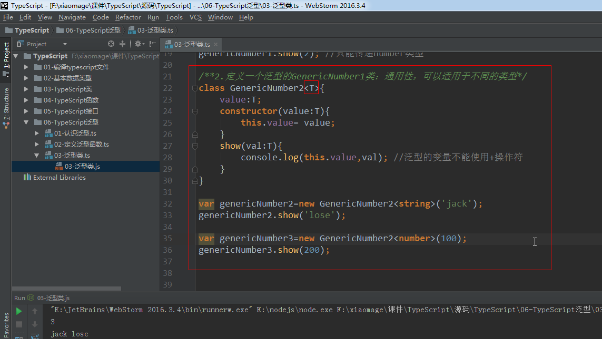

```js
/**
 * Created by liujun on 2018/2/28.
 */
/**1.定义一个普通的GenericNumber1类*/
class GenericNumber1{

    value:number;

    constructor(value:number){
        this.value= value;
    }

    show(val:number){
        console.log(this.value+val);
    }

}
var genericNumber1=new GenericNumber1(1); //只能传递number类型
genericNumber1.show(2); //只能传递number类型

/**2.定义一个泛型的GenericNumber1类：通用性，可以适用于不同的类型*/
class GenericNumber2<T>{
    value:T;
    constructor(value:T){
        this.value= value;
    }
    show(val:T){
        console.log(this.value,val); //泛型的变量不能使用+操作符
    }
}

var genericNumber2=new GenericNumber2<string>('jack');
genericNumber2.show('lose');

var genericNumber3=new GenericNumber2<number>(100);
genericNumber3.show(200);
```

## 8.TypeScript模块

### 1.JavaScript中的模块

zepto.js框架中的模块：https://github.com/madrobby/zepto/tree/master/src

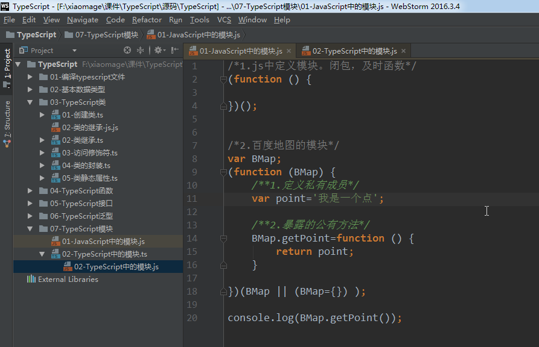

```js
/*1.js中定义模块。闭包，及时函数*/
(function () {

})();


/*2.百度地图的模块*/
var BMap;
(function (BMap) {
    /**1.定义私有成员*/
    var point='我是一个点';

    /**2.暴露的公有方法*/
    BMap.getPoint=function () {
        return point;
    }

})(BMap || (BMap={}) );

console.log(BMap.getPoint());
```


### 2.TypeScript中的模块

https://www.tslang.cn/docs/handbook/namespaces.html

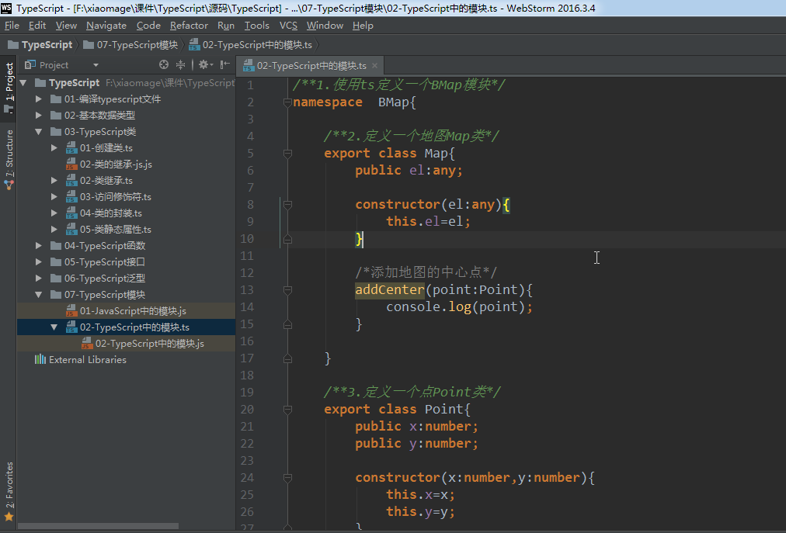

```js
/**1.使用ts定义一个BMap模块，namespace 也可以是 module */
namespace  BMap{

    /**2.定义一个地图Map类*/
    export class Map{
        public el:any;

        constructor(el:any){
            this.el=el;
        }

        /*添加地图的中心点*/
        addCenter(point:Point){
            console.log(point);
        }
        
    }

    /**3.定义一个点Point类*/
    export class Point{
        public x:number;
        public y:number;

        constructor(x:number,y:number){
            this.x=x;
            this.y=y;
        }
    }
}

/**4.使用BMap这个模块Module*/
var map=new BMap.Map('container');
var point=new BMap.Point(116.123434,39.8334234);
map.addCenter(point);
```

